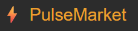
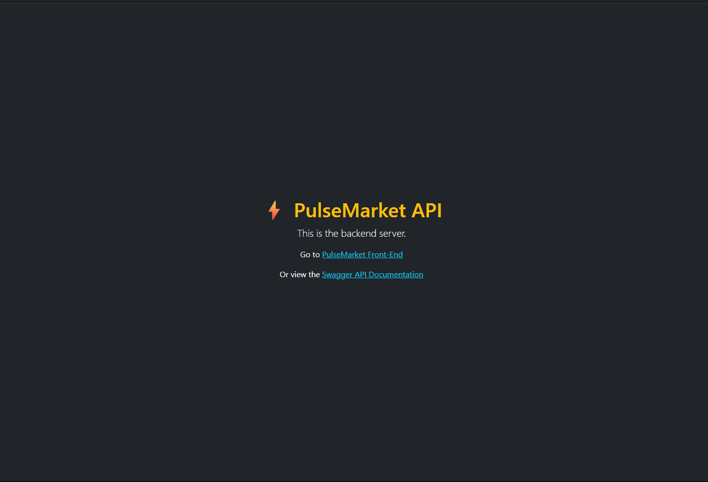
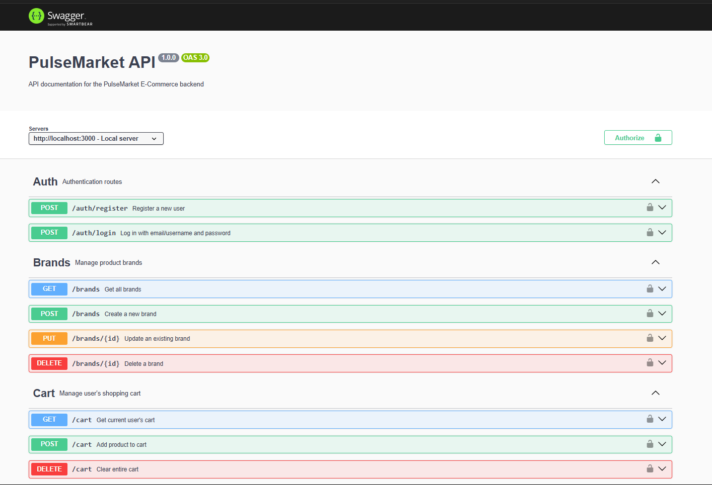

# ⚡ PulseMarket – E-Commerce API



      

> Back-End API for the PulseMarket platform – a fullstack e-commerce app built with Node.js, Sequelize, MySQL, and JWT.

---

## 📚 Table of Contents

- [Tech Stack](#-tech-stack)
- [Setup Instructions](#-setup-instructions)
- [Run Tests](#-run-tests)
- [API Documentation](#-api-documentation)
- [Seed Data](#-seed-data)
- [Features](#️-features)
- [Core Endpoints (API Overview)](#-core-endpoints-api-overview)
  - [Admin Endpoints](#-admin-endpoints)
- [Project Structure](#-project-structure)
- [Screenshot Gallery](#️-screenshot-gallery)
- [Database Structure](#-database-structure)
- [References](#-references)
- [Related Repositories](#-related-repositories)
- [Author](#-author)

---

## 📦 Tech Stack

This back-end was built with **Node.js v20.11.1** and includes the following key libraries:

- Express.js (Node.js)
- Sequelize ORM (with MySQL)
- JWT for Authentication
- Swagger-jsdoc (OpenAPI 3.0)
- Jest + Supertest (Testing)
- Hosted locally (backend & database)

---

## 🚀 Setup Instructions

### 🔧 Prerequisites

- Node.js v18+
- MySQL Server
- (Optional) Postman for testing routes

### 📅 Clone the repo in your editor

```bash
git clone https://github.com/noroff-backend-1/aug24ft-ep-ca-1-runeunhjem.git
cd aug24ft-ep-ca-1-runeunhjem/back-end
```

### 📁 Configure Environment

Create a `.env` file in `back-end/`:

```env
PORT=3000
DB_HOST=localhost
DB_PORT=3306
DB_USER=Admin
DB_PASS=0000
DB_NAME=EcommerceDB
TOKEN_SECRET=supersecretkey
```

### 🛠️ MySQL Setup

Before running the app, make sure your MySQL server is running and that a database matching the `.env` values exists.

#### 📟 1. Create the database

Use your MySQL client (Workbench, CLI, etc.) to run:

```sql
CREATE DATABASE EcommerceDB;
```

Make sure the name matches `DB_NAME` in your `.env` file.

#### 🧑‍💻 2. Configure DB credentials

Ensure your `.env` matches your MySQL setup:

```env
DB_HOST=localhost
DB_PORT=3306
DB_USER=Admin
DB_PASS=0000
DB_NAME=EcommerceDB
```

If using a different username or password, adjust accordingly.

#### 🔄 3. Sync models

When the server starts, Sequelize will sync all models and auto-create the tables. You don’t need to manually run migrations.

---

### 📦 Install dependencies

```bash
npm install
```

### 🏁 Start the Back-End

```bash
npm run dev
```

Back-end API will be available at:
**[http://localhost:3000](http://localhost:3000)**

---

## 🧪 Run tests

```bash
npm test
```

---

## 📚 API Documentation

> ℹ️ **Note**: The Back-End API must be running at `http://localhost:3000` for the API documentation to load properly.

📌 Swagger documentation available at: **[http://localhost:3000/doc](http://localhost:3000/doc)**

- Built with `swagger-jsdoc` (OpenAPI 3.0)
- Includes route descriptions, auth info, body schemas, and sample responses

> The Swagger documentation is generated dynamically at runtime using `swagger-jsdoc` – no manual file generation needed.
> Start the app, then visit: **[http://localhost:3000/doc](http://localhost:3000/doc)**

---

## 🌱 Seed Data

To populate the database with initial test data:

```bash
GET http://localhost:3000/init
```

Seed includes:

- 👤 Demo users (admin and regular)
- 🛡️ Roles: User, Staff, Support, Admin
- 💎 Memberships: Bronze, Silver, Gold
- 🗂️ Categories, 🏷️ Brands, and 🛍️ Products

🛠️ **Note**: The `/init` route includes **more seed data** than the exam specifies, to support extended testing of all features.

---

## 🎛️ Features

- User registration and login with hashed passwords
- JWT-protected API routes
- Cart system with membership-based discounts
- Order creation with historical price snapshot
- Soft-delete support for products
- Admin-only routes for managing users, roles, memberships, brands, categories, products and orders
- Swagger documentation for all major endpoints
- Input validation with helpful error messages
- Jest + Supertest testing of API logic

---

## 🔗 Core Endpoints (API Overview)

| Area         | Endpoint                     | Method   | Description                       |
| ------------ | ---------------------------- | -------- | --------------------------------- |
| Auth         | `/auth/login`                | POST     | Login and receive JWT             |
| Users        | `/users/:id`                 | PATCH    | Update user info (admin or self)  |
| Products     | `/products`, `/products/:id` | GET      | Fetch all or single product       |
| Cart         | `/cart`, `/cart/:productId`  | PATCH    | Add or update items in cart       |
| Orders       | `/orders`, `/orders/:id`     | GET/POST | Create or fetch orders            |
| Docs         | `/doc`                       | GET      | Swagger API docs                  |
| Init Seeder  | `/init`                      | GET      | Populate DB with demo data        |
| Landing Page | `/`                          | GET      | Root route for minimal index page |

### 🔐 Admin Endpoints

| Area        | Endpoint                           | Method            | Description                    |
| ----------- | ---------------------------------- | ----------------- | ------------------------------ |
| Admin Users | `/users`, `/users/:id`             | GET/PATCH         | List, update, deactivate users |
| Roles       | `/roles`, `/roles/:id`             | GET/POST/DELETE   | Manage user roles              |
| Memberships | `/memberships`, `/memberships/:id` | GET/POST/DELETE   | Manage membership levels       |
| Products    | `/products`, `/products/:id`       | POST/PATCH/DELETE | Admin product management       |
| Brands      | `/brands`, `/brands/:id`           | GET/POST/DELETE   | Manage product brands          |
| Categories  | `/categories`, `/categories/:id`   | GET/POST/DELETE   | Manage product categories      |
| Orders      | `/orders/:id/status`               | PATCH             | Admin order status updates     |

---

## 📁 Project Structure

```plaintext
back-end/
├── __tests__/          # Jest + Supertest test files
├── bin/                # Startup script (e.g. www.js)
├── config/             # Sequelize database configuration
├── controllers/        # Route controllers handling business logic
├── middleware/         # JWT auth, error handling, cache control
├── models/             # Sequelize models and associations
├── node_modules/       # Project dependencies (auto-generated)
├── public/             # Static files served by Express
│   ├── images/         # Screenshots, logos, Swagger preview, etc.
│   └── stylesheets/    # Custom CSS overrides
├── routes/             # Express route definitions
├── services/           # Business logic (DB queries, helpers)
├── swagger/            # Swagger-jsdoc config and schema components
├── utils/              # Input validators and shared utilities
├── views/              # Minimal EJS view (index.ejs) for landing page links
├── .env                # Environment variables (not committed)
├── app.js              # Main Express app entry point
├── package.json        # Project metadata, dependencies and scripts
└── README.md           # This README file
```

---

## 🖼️ Screenshot Gallery

Click on any image to view full size.

| PulseMarket API                                                                         | Swagger Docs                                                                            |
| --------------------------------------------------------------------------------------- | --------------------------------------------------------------------------------------- |
| [](public/images/back-end-01.png) | [](public/images/swagger-doc.png) |

> 💡 Screenshots taken during local development.

---

## 🪡 Database Structure

The database schema adheres to **Third Normal Form (3NF)**.

- All entities are logically separated with no redundant data
- `orderItems` table includes snapshot fields like `productName`, `unitPrice`, and `total`
  → Ensures accurate historical records even if the product later changes

📷 See full ERD in the exam report (MySQL Workbench export) or open directly:

[✨ ERD Diagram](../documentation/erd-diagram.png)

[🧹 Jira Timeline](../documentation/jira-timeline.png)

---

## 🥏 REFERENCES

This back-end API was developed by me, **Rune Unhjem**, as part of the Noroff EP1 exam project.
All functionality, logic, and architecture were designed and implemented by me.

### AI Assistance (ChatGPT)

- Code structure planning (routes, controllers, services)
- Syntax suggestions (validation, Sequelize, JWT logic)
- Swagger-jsdoc documentation formatting
- Jest and Supertest test pattern inspiration
  _Used strictly as development support and validation – all final implementations were authored, tested, and adapted by me._

### Forums & Official Docs

- [Stack Overflow](https://stackoverflow.com/) – Sequelize, JWT, and routing issues
- [Sequelize Docs](https://sequelize.org/) – Models, associations, and query usage
- [MDN Web Docs](https://developer.mozilla.org/) – JS syntax and array/object methods
- [Swagger-jsdoc Docs](https://github.com/Surnet/swagger-jsdoc) – API documentation setup

### Personal Help

- None — this back-end was completed independently.

---

## 🔗 Related Repositories

- 🖥️ [Front-End Admin Panel](../front-end/README.md)

---

## 📗 Author

**Rune Unhjem**

- 🌐 [Portfolio](https://rundev-portfolio.netlify.app/)
- 🤝 GitHub: [@runeunhjem](https://github.com/runeunhjem)
- 💼 LinkedIn: [runeunhjem](https://www.linkedin.com/in/runeunhjem/)
