# ⚡ PulseMarket – Front-End with Admin Panel

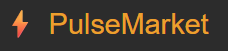

    

> _Part of the Noroff EP1 Exam Project – Front-End with Admin Panel for the PulseMarket e-commerce platform._

---

## 📚 Table of Contents

- [Overview](#-overview)
- [Tech Stack](#-tech-stack)
- [Setup Instructions](#-setup-instructions)
- [Login Credentials (Seeded)](#-login-credentials-seeded)
- [Features](#️-features)
- [Project Structure](#-project-structure)
- [Backend Integration](#-backend-integration)
- [Related Repositories](#-related-repositories)
- [Screenshot Gallery](#️-screenshot-gallery)
- [References](#-references)
- [Author](#-author)

---

## 🌐 Overview

> ℹ️ This front-end is not deployed. To test, run locally alongside the back-end API.

This front-end provides both a modern e-commerce store front for customers and a responsive, role-restricted dashboard for administrators to manage:

- Products
- Categories
- Brands
- Users
- Orders
- Memberships
- Roles

Built using **Express.js**, **EJS templates**, and **Bootstrap 5** to match the PulseMarket backend API.

---

## 🧱 Tech Stack

This front-end was built with **Node.js v20.11.1** and includes the following key libraries:

- Express.js
- EJS Template Engine
- Axios
- Bootstrap 5
- dotenv
- express-session
- connect-flash

---

## 🚀 Setup Instructions

### 📅 Clone the repo in your editor

```bash
git clone https://github.com/noroff-backend-1/aug24ft-ep-ca-1-runeunhjem.git
cd aug24ft-ep-ca-1-runeunhjem/front-end
```

### 📁 Configure Environment

Create a `.env` file in `front-end/`:

```env
PORT=3001
BACKEND_URL=http://localhost:3000
SESSION_SECRET=frontsecretkey
```

### 📦 Install dependencies

```bash
npm install
```

### ⚠️ Backend & Database Requirement

Make sure the [Back-End API](../back-end/README.md) is running **with a working database connection** before starting the front-end. The front-end depends on the backend to:

- Authenticate users via JWT
- Fetch and manage products, categories, brands, users, etc.
- Create and view orders and cart items

```bash
# In a separate terminal:
cd ../back-end
npm run dev
```

Ensure your `.env` file in `front-end/` points to the correct backend URL (e.g., `http://localhost:3000`).

### 🏁 Start the front-end

```bash
npm run dev
```

Runs the app with automatic reloads using nodemon (if installed).

Front-end with Admin panel will be available at: **[http://localhost:3001](http://localhost:3001)**

---

## 🔐 Login Credentials (Seeded)

| Role    | Username   | Password       |
| ------- | ---------- | -------------- |
| Admin   | `Admin`    | `P@ssword2023` |
| User    | `testuser` | `test123!`     |
| Support | `support`  | `test123!`     |
| Staff   | `staff`    | `test123!`     |

> ⚠️ Only users with the **Admin** role can access the Admin Panel.

🛈 For local dev/testing only. Change or remove before production.

---

## 🎛️ Features

- Customer-facing store front
- Admin login with session handling
- Responsive dashboard with Bootstrap 5
- Table views with edit/delete/reactivate actions
- Modal-based user/product management
- Product filtering and sorting tools
- Real-time role/membership management
- Clean EJS structure with partials and utilities
- Dynamic token-based communication with backend API

---

## 📁 Project Structure

```plaintext
front-end/
├── node_modules/       # Dependencies (ignored by Git)
├── public/             # Static files served by Express
│   ├── images/         # Screenshots and logo
│   ├── javascripts/    # Frontend JS logic
│   └── stylesheets/    # Custom CSS files
├── routes/             # ExpressJS frontend routes (not backend API)
├── views/              # EJS templates
├── .env                # Environment variables
├── app.js              # Entry point
├── package.json        # Project metadata and dependencies
```

---

## 🔄 Backend Integration

This admin interface connects to the **PulseMarket API** using the `BACKEND_URL` defined in the `.env` file.

All CRUD operations are performed via `fetch()` and `axios` requests to the backend.

Sensitive operations (such as editing users or managing roles) are secured with JWT-based session validation.

---

## 🔗 Related Repositories

- ⚙️ [Back-End API readme](../back-end/README.md)

---

## 🖼️ Screenshot Gallery

Below are selected screenshots showing both the **customer-facing** and **admin** views. Click any image to view full size.

| Home                                                                                      | Public Products                                                                           | Product Details                                                                           |
| ----------------------------------------------------------------------------------------- | ----------------------------------------------------------------------------------------- | ----------------------------------------------------------------------------------------- |
| [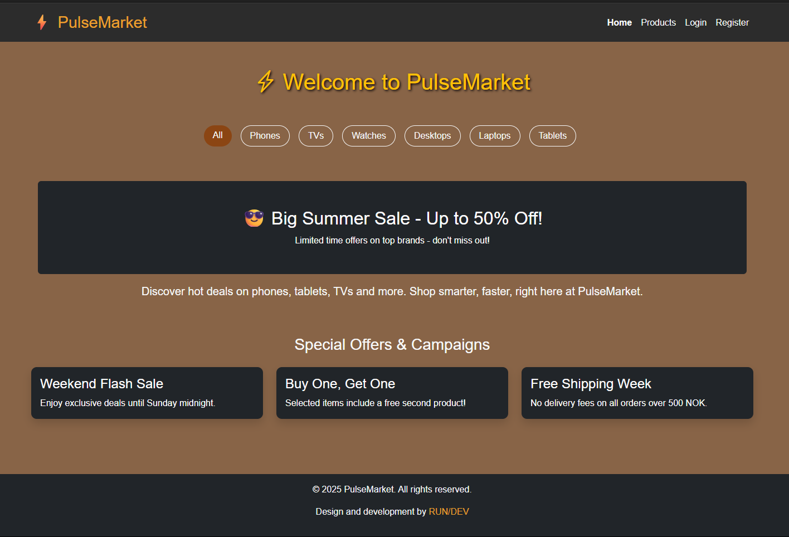](public/images/front-end-01.png) | [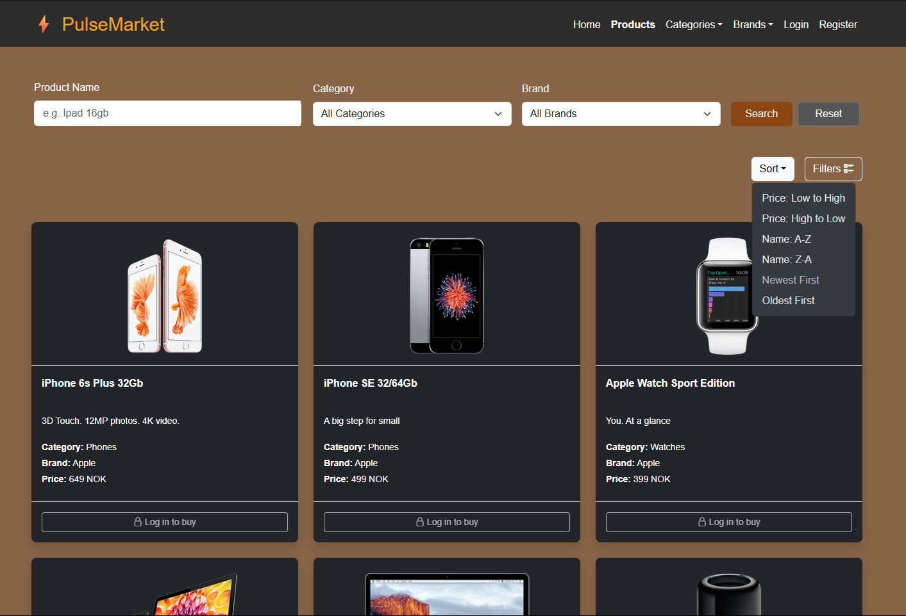](public/images/front-end-14.png) | [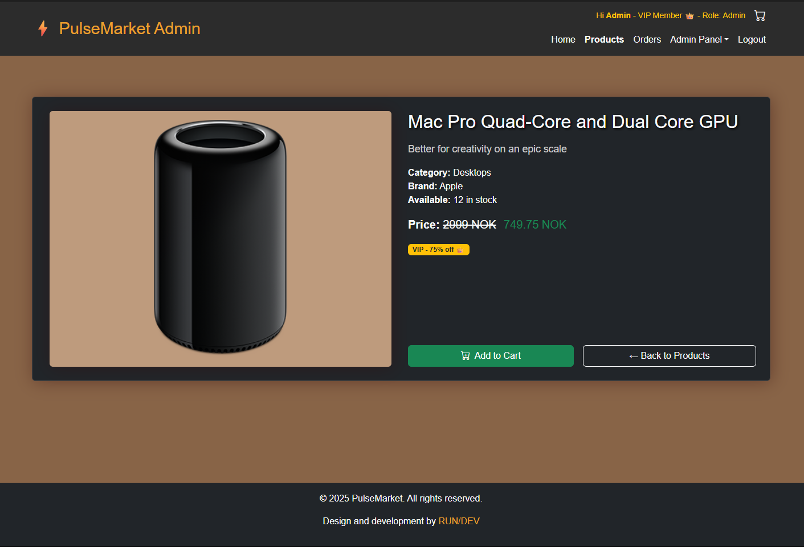](public/images/front-end-15.png) |

| Sign Up                                                                                   | Log In                                                                                    | Cart                                                                                      |
| ----------------------------------------------------------------------------------------- | ----------------------------------------------------------------------------------------- | ----------------------------------------------------------------------------------------- |
| [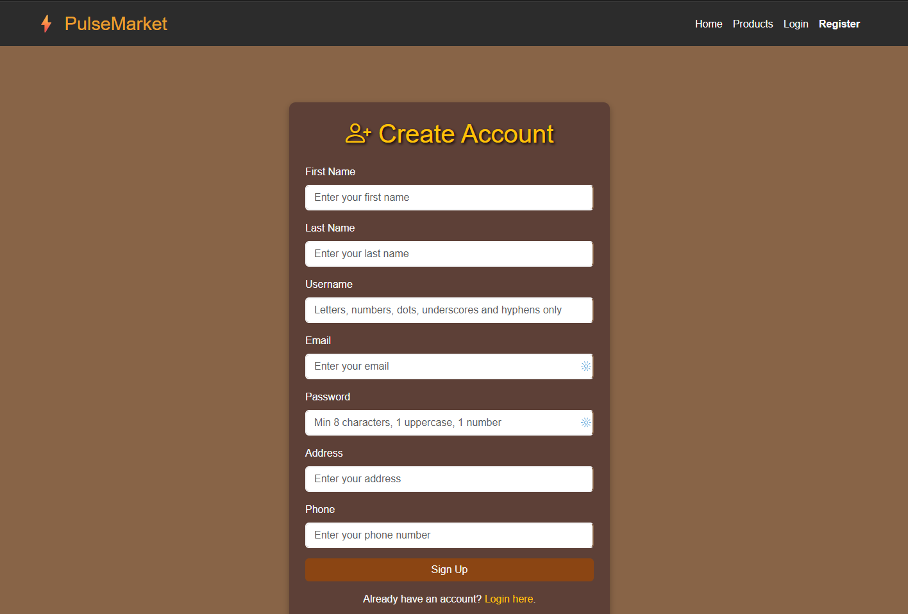](public/images/front-end-02.png) | [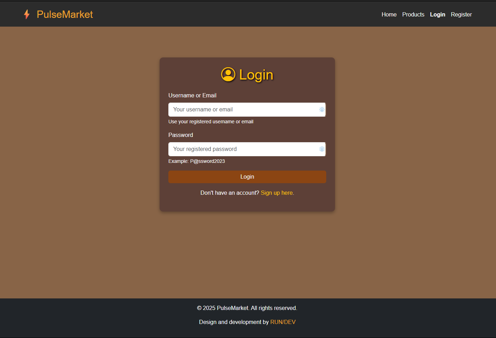](public/images/front-end-03.png) | [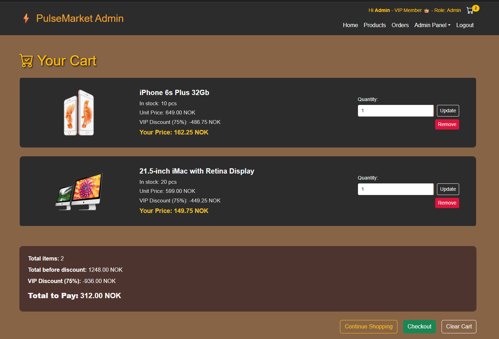](public/images/front-end-05.png) |

| Your Orders                                                                               | Admin Dashboard                                                                           | Manage Products                                                                           |
| ----------------------------------------------------------------------------------------- | ----------------------------------------------------------------------------------------- | ----------------------------------------------------------------------------------------- |
| [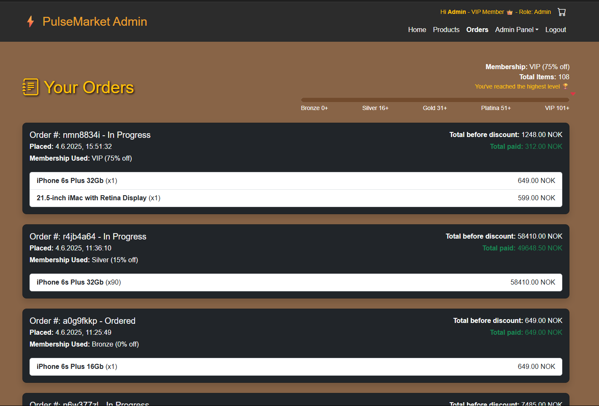](public/images/front-end-06.png) | [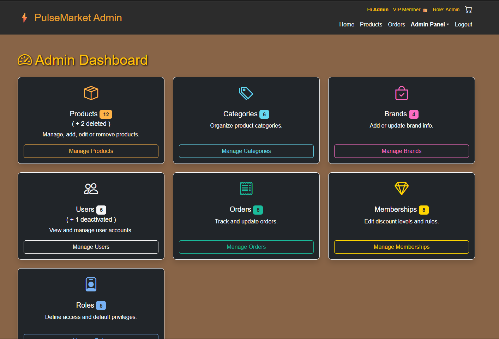](public/images/front-end-04.png) | [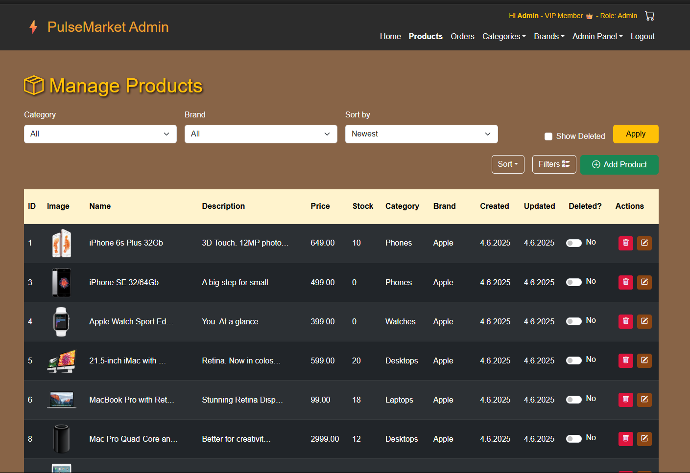](public/images/front-end-07.png) |

| Manage Categories                                                                         | Manage Brands                                                                             | Manage Users                                                                              |
| ----------------------------------------------------------------------------------------- | ----------------------------------------------------------------------------------------- | ----------------------------------------------------------------------------------------- |
| [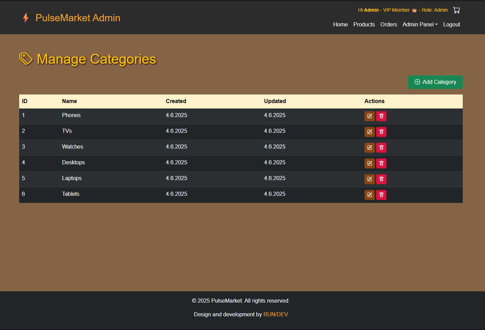](public/images/front-end-08.png) | [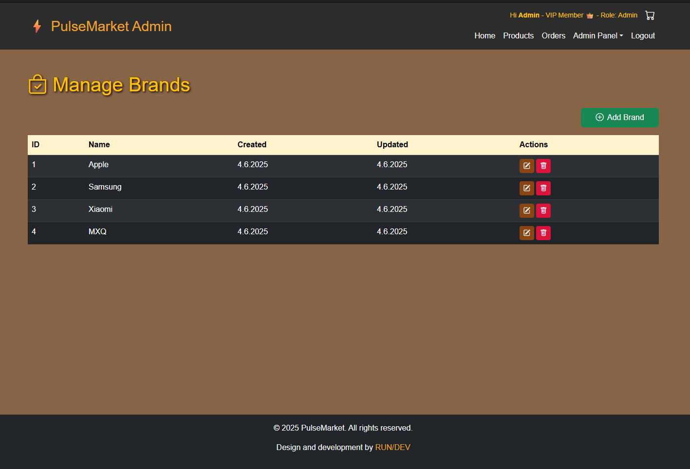](public/images/front-end-09.png) | [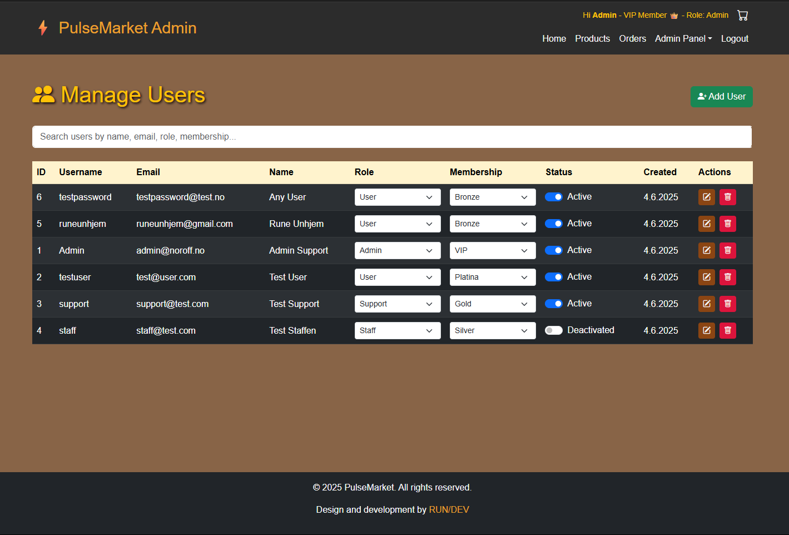](public/images/front-end-11.png) |

| Manage Roles                                                                              | Manage Memberships                                                                        | Manage Orders                                                                             |
| ----------------------------------------------------------------------------------------- | ----------------------------------------------------------------------------------------- | ----------------------------------------------------------------------------------------- |
| [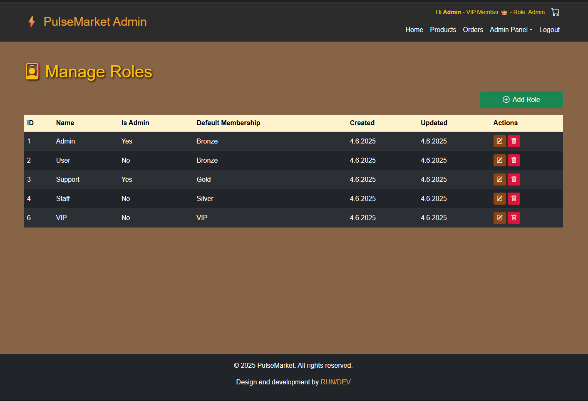](public/images/front-end-13.png) | [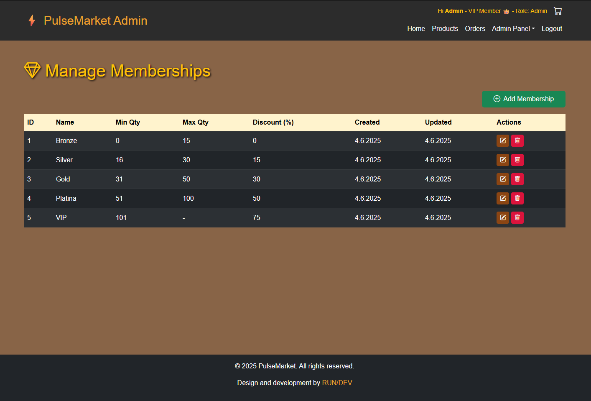](public/images/front-end-12.png) | [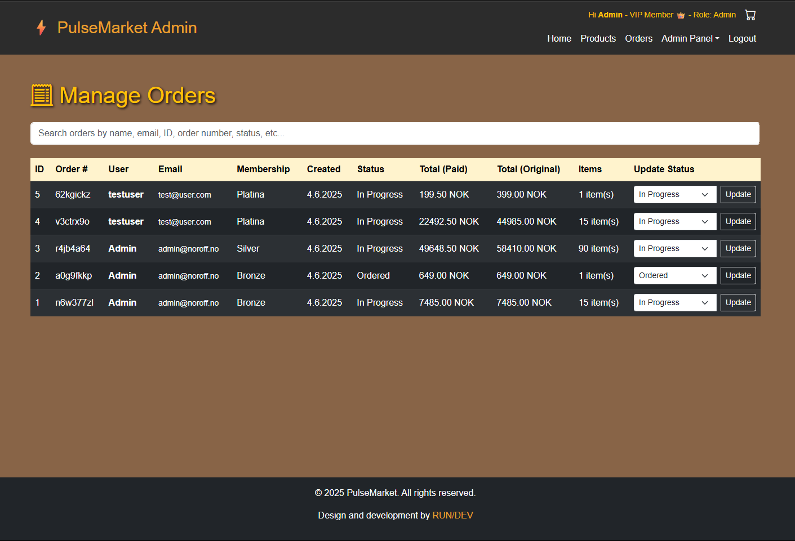](public/images/front-end-10.png) |

> 💡 Screenshots taken during local development.

---

## 🥏 REFERENCES

This front-end was developed by me, **Rune Unhjem**, as part of the Noroff EP1 exam project.
All layout, logic, and integration with the PulseMarket API were designed and implemented by me.

### AI Assistance (ChatGPT)

- JavaScript fetch patterns
- EJS layout and partials structure
- Bootstrap 5 component usage
- Code refactoring strategies
  _Used strictly as development support and validation – all final implementations were authored, tested, and adapted by me._

### Forums & Official Docs

- [Stack Overflow](https://stackoverflow.com/) – Troubleshooting front-end route/session issues
- [Bootstrap Docs](https://getbootstrap.com/) – Component layout and styling references
- [MDN Web Docs](https://developer.mozilla.org/) – JS syntax and DOM methods

### Personal Help

- None — this front-end was completed independently.

---

## 📗 Author

**Rune Unhjem**

- 🌐 [Portfolio](https://rundev-portfolio.netlify.app/)
- 🤝 GitHub: [@runeunhjem](https://github.com/runeunhjem)
- 💼 LinkedIn: [runeunhjem](https://www.linkedin.com/in/runeunhjem/)
